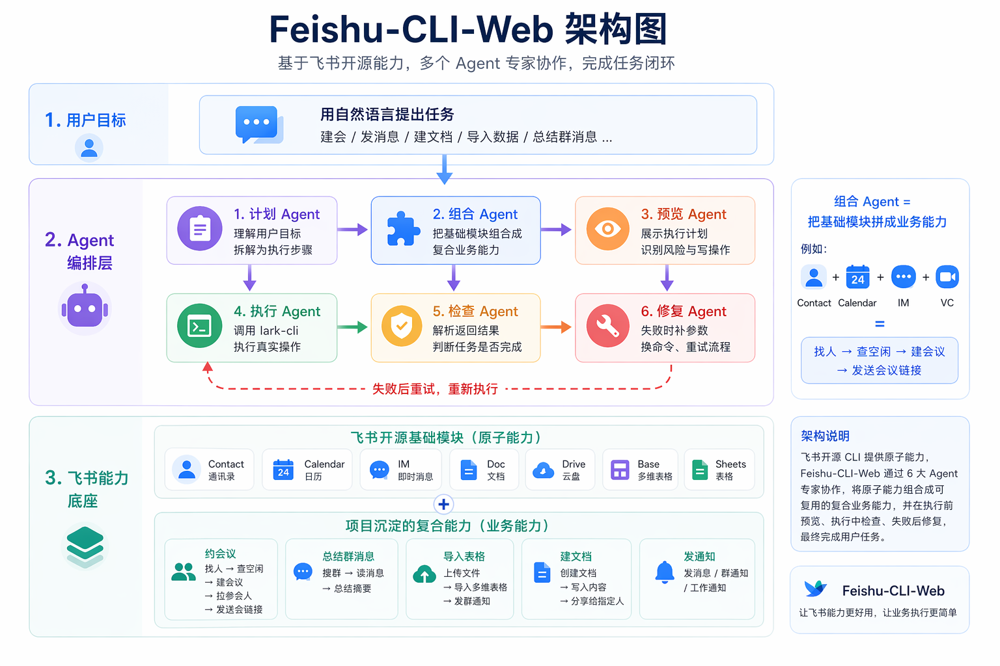
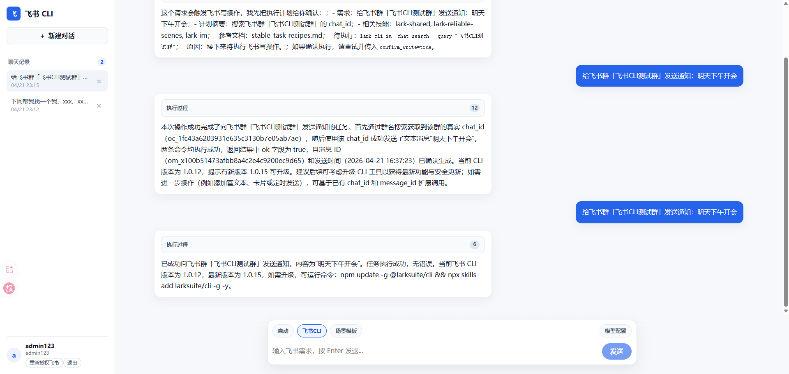

# Feishu CLI Web


把飞书/Lark CLI 变成一个可私有化部署的 Web 智能工作台。

Feishu CLI Web 基于官方 `lark-cli`，提供自然语言交互、执行计划预览、写操作确认、多用户隔离和 SQLite 本地存储。它适合团队把飞书自动化能力快速接入自己的 Agent、内部工具或运维平台。

[](LICENSE)
[](https://www.python.org/)
[](https://fastapi.tiangolo.com/)
[](https://vuejs.org/)

## 它解决什么问题

飞书官方 CLI 能力很完整，但团队成员通常不想记命令、配置参数、处理授权和调试输出。Feishu CLI Web 在 CLI 之上加了一层更适合团队使用的 Web 工作流：


- 用自然语言描述飞书任务
- 执行前预览计划和命令
- 写操作需要确认，降低误操作风险
- 每个用户独立授权，互不影响
- 聊天记录、执行记录、账号信息统一保存到 SQLite
- 内置常用场景模板，便于沉淀团队流程
- 一次部署，多人使用：每个用户有独立的账号，互不影响。
- 专注于飞书CLI能力的Agent：响应速度超快。

## 典型场景

```text
帮我和 刘鑫 在 明天 找一个 1小时 的空闲时间，创建主题为「项目复盘」的会议，并把会议链接发给他
```

系统会先生成计划：

```text
1. 搜索联系人 刘鑫
2. 查询明天工作时间内双方共同空闲时间
3. 创建「项目复盘」会议
4. 邀请参会人
5. 发送会议链接
```

确认后才会真正执行飞书写操作。

## 功能亮点

- **自然语言飞书操作**：发消息、建会议、查日程、创建文档、导入多维表格等。
- **计划预览**：先看清楚系统准备做什么，再决定是否执行。
- **场景模板**：群通知、会议安排、文档创建、多维表格导入、会议纪要总结等。
- **多用户隔离**：每个 Web 账号有独立的 `lark-cli` HOME、授权状态和会话数据。
- **SQLite 存储**：账号、登录态、会话、消息、执行记录集中在一个数据库文件里。
- **OpenAI 兼容模型**：支持 Qwen、OpenAI、GLM、Doubao 等兼容接口。
- **开源友好**：Skill 文档、场景模板、计划预览、存储层已拆分，方便贡献。
- **一次部署，多人使用**：每个用户有独立的账号，互不影响。
- **专注于飞书CLI能力的Agent**：响应速度超快。
- **支持Docker部署**：docker compose一键部署到Docker服务。

## 支持的飞书能力

| 模块 | 能力 |
| --- | --- |
| IM | 用户/群搜索、发消息、群消息读取 |
| Calendar | 日程查询、忙闲推荐、会议创建、参会人邀请 |
| Contact | 联系人搜索、用户信息查询 |
| Doc / Wiki | 文档创建、检索、更新 |
| Drive | 文件上传、导入、下载、评论 |
| Base | 多维表格、字段、记录、视图、仪表盘、工作流 |
| Sheets | 电子表格读写、样式、过滤视图、导出 |
| Task | 任务、任务清单、提醒、评论 |
| More | Mail、Minutes、VC、Whiteboard、Approval、Attendance、Event 等 |

## 技术栈（依赖包）

- Backend：FastAPI、Pydantic、SQLite、OpenAI SDK、Anthropic SDK、PyYAML
- Frontend：Vue 3、TypeScript、Vite、SSE
- Runtime：官方 `@larksuite/cli`

## 快速开始

### 1. 准备环境

需要：

- Python 3.10+
- Node.js 16+
- npm / npx
- 一个 OpenAI 兼容模型 API Key

建议先确认版本：

```bash
python --version
node --version
npm --version
```

Windows 如果 `python` 不可用，可以把后续命令里的 `python` 换成 `py -3`。

可选：提前安装官方飞书 CLI。Linux/macOS 如果全局安装遇到权限问题，可以使用 Node 版本管理器，或按终端提示加 `sudo`。

```bash
npm install -g @larksuite/cli
npx skills add larksuite/cli -y -g
```

如果没有提前安装，页面首次授权时也会提示安装。

### 2. 克隆项目

```bash
git clone https://github.com/yourname/Feishu-CLI-Web.git
cd Feishu-CLI-Web
```

### 3. 配置后端

推荐使用虚拟环境，避免污染系统 Python。

Linux/macOS：

```bash
cd backend
python -m venv .venv
source .venv/bin/activate
python -m pip install --upgrade pip
python -m pip install -r requirements.txt
```

Windows PowerShell：

```powershell
cd backend
py -3 -m venv .venv
.\.venv\Scripts\Activate.ps1
python -m pip install --upgrade pip
python -m pip install -r requirements.txt
```

复制环境变量文件：

Linux/macOS：

```bash
cd ..
cp .env.example .env
```

Windows PowerShell：

```powershell
cd ..
Copy-Item .env.example .env
```

编辑 `.env`：

```env
LLM_PROVIDER=openai
OPENAI_BASE_URL=https://dashscope.aliyuncs.com/compatible-mode/v1
LLM_MODEL=qwen-plus
OPENAI_API_KEY=your_api_key_here
APP_NAME=Feishu CLI Web
API_PREFIX=/api/v1
LARK_CLI_COMMAND_TIMEOUT=120
```

### 4. 启动后端

确保当前目录是 `backend`，并且虚拟环境已激活。

```bash
cd backend
python -m uvicorn app.main:app --reload --host 0.0.0.0 --port 8000
```

### 5. 启动前端

```bash
cd frontend
npm ci
npm run dev
```

访问：

- Web：http://localhost:3000
- API Docs：http://localhost:8000/docs

开发模式下，Vite 会把 `/api` 自动代理到后端。默认目标是：

```text
http://127.0.0.1:8000
```

如果后端不在本机，例如跑在另一台服务器或局域网机器上，可以临时覆盖：

Linux/macOS：

```bash
VITE_API_TARGET=http://192.168.1.10:8000 npm run dev
```

Windows PowerShell：

```powershell
$env:VITE_API_TARGET="http://192.168.1.10:8000"
npm run dev
```

如果你没有提交 `package-lock.json`，可以把 `npm ci` 换成 `npm install`。当前仓库已经包含 lock 文件，优先用 `npm ci` 可以保证不同机器安装结果一致。

启动后可以先做一次最小检查：

```bash
curl http://127.0.0.1:8000/health
```

返回 `{"status":"ok"}` 说明后端已启动。然后打开 Web，使用默认账号登录，再按页面提示连接飞书。

### 6. 生产构建

```bash
cd frontend
npm ci
npm run build
```

把 `frontend/dist/` 交给 Nginx、Caddy 或其它静态文件服务。生产环境需要把 `/api` 反向代理到后端，例如 `http://127.0.0.1:8000`。

## Docker 部署

仓库内置单容器部署方式：构建阶段会打包前端，运行阶段由 FastAPI 同时提供 API 和前端页面。容器内会安装 Node.js、npm、Git、官方 `@larksuite/cli` 和飞书 CLI skills。

### 1. 准备 `.env`

```bash
cp .env.example .env
```

Windows PowerShell：

```powershell
Copy-Item .env.example .env
```

编辑 `.env`，至少填入模型配置：

```env
LLM_PROVIDER=openai
OPENAI_BASE_URL=https://dashscope.aliyuncs.com/compatible-mode/v1
LLM_MODEL=qwen-plus
OPENAI_API_KEY=your_api_key_here
API_PREFIX=/api/v1
LARK_CLI_COMMAND_TIMEOUT=120
```

### 2. 使用 Docker Compose 启动

```bash
docker compose up -d --build
```

访问：

- Web：http://localhost:8000
- API Docs：http://localhost:8000/docs
- Health：http://localhost:8000/health

查看日志：

```bash
docker compose logs -f
```

停止服务：

```bash
docker compose down
```

运行期数据会保存在 Docker volume `feishu-cli-web_feishu_cli_data` 中，对应容器内目录：

```text
/app/.feishu_cli_data
```

如果要同时删除数据卷：

```bash
docker compose down -v
```

### 3. 只用 Dockerfile

```bash
docker build -t feishu-cli-web .
docker run -d \
  --name feishu-cli-web \
  --env-file .env \
  -p 8000:8000 \
  -v feishu_cli_data:/app/.feishu_cli_data \
  feishu-cli-web
```

Windows PowerShell：

```powershell
docker build -t feishu-cli-web .
docker run -d `
  --name feishu-cli-web `
  --env-file .env `
  -p 8000:8000 `
  -v feishu_cli_data:/app/.feishu_cli_data `
  feishu-cli-web
```

### 4. Docker 常见问题

- 构建时下载依赖失败：确认服务器可以访问 npm registry、PyPI、GitHub 和飞书 CLI 相关包；公司网络下通常需要配置 Docker 代理。
- `Failed to clone repository` 或 `spawn git ENOENT`：说明镜像里缺少 Git。请确认使用的是最新 Dockerfile，里面会安装 `git`。
- `docker compose` 不存在：新版 Docker Desktop 自带 `docker compose`；旧版本可能是 `docker-compose`。
- 授权后重启丢失：确认已经挂载 `/app/.feishu_cli_data` 数据卷。
- 前端可以打开但 API 失败：Docker 单容器模式下前端和 API 都在 `8000` 端口，通常不需要额外反向代理；如果放到 Nginx 后面，请把 `/api`、`/docs`、`/openapi.json` 转发到容器。
- 需要备份数据：备份 Docker volume 中的 `.feishu_cli_data`，重点是 `feishu_cli_web.sqlite3` 和 `lark_cli_users/`。

## 默认账号

首次启动时，如果数据库中没有账号，系统会自动创建：

| 账号 | 密码 |
| --- | --- |
| `admin123` | `000000` |
| `admin` | `000000` |
| `local` | `000000` |

这些账号只适合本地开发和演示。正式部署前请修改默认密码，或接入自己的认证系统。

默认账号只会在 `accounts` 表为空时初始化。正式部署时建议先新增自己的管理员账号，再删除演示账号；只要表里还有正式账号，系统不会把演示账号补回来。

## SQLite 与账号管理

项目默认使用 SQLite 保存运行期数据，不需要额外安装数据库服务。数据库文件会在首次启动后自动创建：

```text
.feishu_cli_data/feishu_cli_web.sqlite3
```

主要数据表：

- `accounts`：Web 登录账号和密码哈希
- `auth_sessions`：Web 登录 token
- `chat_sessions` / `chat_messages`：聊天会话和消息
- `execution_records`：飞书 CLI 执行记录
- `profile_states`：每个 Web 账号对应的飞书授权状态

如果只是本地开发，可以直接使用默认账号。团队部署时，建议用脚本批量维护账号，不要手改数据库。

### 批量新增或更新用户

编辑：

```text
backend/data/users_upsert.json
```

示例：

```json
{
  "users": [
    {
      "account": "demo",
      "name": "Demo User",
      "password": "000000"
    }
  ]
}
```

执行：

```bash
cd backend
python data/manage_users.py --add-file data/users_upsert.json
```

同一个 `account` 已存在时，脚本会更新昵称和密码。

### 批量删除用户

编辑：

```text
backend/data/users_delete.json
```

示例：

```json
{
  "accounts": [
    "demo"
  ]
}
```

执行：

```bash
cd backend
python data/manage_users.py --delete-file data/users_delete.json
```

删除用户时会同步清理该账号的 Web 登录态、聊天记录、执行记录和飞书授权状态。默认不会删除隔离的官方 `lark-cli` HOME 目录；如果确认不再需要该用户的本地飞书授权缓存，可以加参数：

```bash
python data/manage_users.py --delete-file data/users_delete.json --purge-cli-data
```

### 常用维护命令

```bash
# 查看当前账号
python data/manage_users.py --list

# 预览新增/更新，不写入数据库
python data/manage_users.py --add-file data/users_upsert.json --dry-run

# 预览删除，不写入数据库
python data/manage_users.py --delete-file data/users_delete.json --dry-run

# 指定其它 SQLite 文件
python data/manage_users.py --db ../.feishu_cli_data/feishu_cli_web.sqlite3 --list
```

这些命令也可以从项目根目录运行：

```bash
python backend/data/manage_users.py --add-file backend/data/users_upsert.json
python backend/data/manage_users.py --delete-file backend/data/users_delete.json
```

也可以使用 DB Browser for SQLite、DBeaver、DataGrip 等 SQLite 工具查看数据，但不建议直接改 `password_hash`、`auth_sessions` 或飞书授权相关字段。新增、改密、删除账号优先使用脚本，避免状态不一致。

## 飞书授权

登录后，如果当前账号还没有完成飞书 CLI 初始化或授权，页面会显示「连接飞书账号」卡片。

授权流程会做这些事：

1. 检查 `lark-cli` 是否可用
2. 为当前 Web 用户准备独立 CLI 环境
3. 生成飞书授权链接
4. 等待用户在浏览器中完成授权
5. 保存该 Web 账号的独立授权状态

侧边栏提供「重新授权飞书」入口。重新授权会分两步执行：

1. 执行官方 `lark-cli auth logout`，并清除当前 Web 用户隔离环境中的旧授权缓存
2. 按首次连接飞书账号的同一流程生成新的授权链接，并等待用户完成登录

它不会强制重装 CLI，也不会重建已有应用配置。

## 定时任务

当用户提出明显的定时需求时，系统会把它识别为后台定时任务，而不是立即执行飞书写操作。

支持的常见表达：

```text
每天上午9点帮我给飞书CLI测试群发一条消息：请大家填写日报
每日 18:00 帮我总结【项目群】今天的消息
明天上午10点帮我给张三发消息：记得参加评审会
2026年4月25日 9点帮我创建项目复盘文档
```

定时任务闭环：

1. 用户输入定时需求
2. 系统生成执行计划预览，标记为“创建定时任务”
3. 用户点击“确认执行”
4. 系统把任务写入 SQLite 的 `scheduled_tasks` 表
5. 后端调度器到点自动执行飞书任务
6. 执行结果写回当前会话和执行记录
7. 一次性任务执行后变为 `completed`；每日任务会自动计算下一次执行时间

为了避免误判，系统只把带有明确时刻的请求识别为定时任务，例如 `9点`、`09:30`、`下午三点`。像“明天找一个 1 小时空闲时间”这类日程规划请求不会被当成后台定时任务。

输入框上方提供「定时任务」面板：

- 全局开关：关闭后不会创建新的定时任务，后台调度器也不会执行已有任务；再次开启后，处于 `active` 状态且到期的任务会继续执行。
- 调度配置：可以调整后台轮询间隔，配置会写入 SQLite 并在下一轮调度生效。
- 任务列表：只显示当前登录账号已添加的定时任务，避免不同账号之间互相看到任务内容。
- 单任务开关：每个任务可以单独暂停或恢复，适合临时停用某个重复任务。
- 删除保护：任务必须先关闭为 `paused` 状态，前端二次确认后才能删除；后端也会拒绝删除未关闭的任务。

`.env` 支持配置定时任务默认值：

```env
SCHEDULED_TASKS_ENABLED=true
SCHEDULED_TASK_POLL_SECONDS=30
```

说明：

- `SCHEDULED_TASKS_ENABLED` 只决定首次启动或 SQLite 中还没有运行时配置时的默认开关。
- 页面上的全局开关会写入 SQLite 的 `system_settings` 表，重启服务后仍然生效。
- `SCHEDULED_TASK_POLL_SECONDS` 是后台调度轮询间隔，建议保持 `30` 秒；系统会限制在 `5` 到 `3600` 秒之间。

可以通过 API 查看和管理当前账号的定时任务：

```bash
curl -H "X-Auth-Token: <login_token>" "http://127.0.0.1:8000/api/v1/scheduled-tasks"
curl -H "X-Auth-Token: <login_token>" http://127.0.0.1:8000/api/v1/scheduled-tasks/config
curl -X POST -H "Content-Type: application/json" -H "X-Auth-Token: <login_token>" \
  -d '{"enabled":false,"poll_seconds":30}' http://127.0.0.1:8000/api/v1/scheduled-tasks/config
curl -X POST -H "X-Auth-Token: <login_token>" http://127.0.0.1:8000/api/v1/scheduled-tasks/1/pause
curl -X POST -H "X-Auth-Token: <login_token>" http://127.0.0.1:8000/api/v1/scheduled-tasks/1/resume
curl -X DELETE -H "X-Auth-Token: <login_token>" http://127.0.0.1:8000/api/v1/scheduled-tasks/1
```

## 数据目录

运行期数据默认集中在：

```text
.feishu_cli_data/
  feishu_cli_web.sqlite3
  lark_cli_profiles/
  lark_cli_users/
```

说明：

- `feishu_cli_web.sqlite3`：账号、登录 token、聊天会话、消息、执行记录、profile 状态
- `scheduled_tasks` 表：后台定时任务、下次执行时间、执行状态和最近执行结果
- `lark_cli_profiles/`：Web 侧 profile 状态
- `lark_cli_users/`：每个 Web 用户独立的官方 `lark-cli` HOME

不要提交或分享这些敏感数据：

```text
.env
.feishu_cli_data/
.lark_cli_profiles/
.lark_cli_users/
.auth_accounts.json
.auth_sessions.json
frontend/node_modules/
frontend/dist/
```

旧版本的 `.auth_accounts.json`、`.auth_sessions.json`、`.feishu_cli_data/sessions/*.json` 已被 SQLite 替代。

## API 概览

除 `/health` 和登录接口外，业务 API 需要携带登录 token。前端会自动处理；如果你直接调用 API，需要在请求头里加：

```text
X-Auth-Token: <login_token>
```

| API | 说明 |
| --- | --- |
| `GET /health` | 健康检查 |
| `POST /api/v1/auth/login` | 登录 |
| `GET /api/v1/auth/me` | 当前账号 |
| `POST /api/v1/chat/plan` | 生成执行计划，不执行命令 |
| `POST /api/v1/chat` | 执行聊天请求，支持 SSE |
| `GET /api/v1/sessions` | 会话列表 |
| `GET /api/v1/scenarios` | 场景模板列表 |
| `POST /api/v1/scenarios/render` | 渲染场景模板 |
| `GET /api/v1/scheduled-tasks` | 当前账号定时任务列表 |
| `GET /api/v1/scheduled-tasks/config` | 定时任务全局配置 |
| `POST /api/v1/scheduled-tasks/config` | 开启或关闭全局定时任务 |
| `POST /api/v1/scheduled-tasks/{task_id}/pause` | 暂停定时任务 |
| `POST /api/v1/scheduled-tasks/{task_id}/resume` | 恢复定时任务 |
| `DELETE /api/v1/scheduled-tasks/{task_id}` | 删除已暂停的定时任务 |
| `GET /api/v1/models/config` | 模型配置 |
| `POST /api/v1/models/config` | 保存模型配置 |
| `GET /api/v1/lark/setup/status` | 飞书 CLI 状态 |
| `POST /api/v1/lark/setup/stream` | 初始化或重新授权飞书 CLI |

## 部署检查清单

上线前建议逐项确认：

- 后端使用 Python 3.10+，并通过 `python -m pip install -r backend/requirements.txt` 安装依赖。
- 前端使用 Node.js 16+，并通过 `npm ci` 安装依赖。
- `.env` 已配置模型 API Key、模型名称和 API 地址。
- 如需启用定时任务，确认 `.env` 中 `SCHEDULED_TASKS_ENABLED=true`，并在页面「定时任务」面板中保持全局开关开启。
- `.feishu_cli_data/` 所在目录对后端进程可写。
- 服务器能执行 `npm`、`npx` 和 `lark-cli`。如果没有预装 `lark-cli`，首次授权页面会引导安装。
- 生产环境已经把前端 `/api` 反向代理到后端。
- 默认账号密码已经修改，或已通过 `backend/data/manage_users.py` 新建正式账号并删除演示账号。
- 用 `curl http://127.0.0.1:8000/health` 检查后端健康状态。
- 用浏览器打开前端并完成一次登录，确认 `/api/v1/auth/me` 不再返回 401。

常见问题：

- `python: command not found`：Windows 使用 `py -3`，Linux/macOS 确认已安装 Python 3.10+。
- `npm ci` 失败：先确认 Node.js 版本；如果 lock 文件被删除，改用 `npm install`。
- `lark-cli command was not found`：运行 `npm install -g @larksuite/cli`，然后重启后端进程。
- Linux/macOS 全局安装 npm 包权限不足：使用 Node 版本管理器，或按系统策略使用 `sudo npm install -g @larksuite/cli`。
- SQLite 报只读或 I/O 错误：确认 `.feishu_cli_data/` 目录存在且后端进程有写权限。
- 前端能打开但接口 404 或跨域失败：开发环境确认 `frontend/vite.config.ts` 的 `VITE_API_TARGET` 指向后端；生产环境确认 Nginx/Caddy 已转发 `/api`。

## 项目结构

```text
Feishu-CLI-Web/
  backend/
    data/                     # SQLite account maintenance scripts and JSON examples
    app/
      api/routes/              # FastAPI routes
      core/                    # SQLite, sessions, templates, records
      skills/lark_cli/
        skills/                # Skill markdown docs and references
        plan_preview.py        # dry-run plan preview
        skill_runtime.py       # Lark CLI runtime orchestrator
    requirements.txt
  frontend/
    src/components/            # Vue components
    src/lib/                   # frontend helpers
    package.json
  doc/                         # screenshots, videos, sharing docs
  .env.example
  README.md
```

## 如何扩展

### 增加场景模板

编辑：

```text
backend/app/core/scenario_templates.py
```

适合沉淀团队常用流程，例如：

- 创建项目周会
- 发送发布通知
- 导入销售数据到多维表格
- 从会议纪要生成任务

### 增加飞书 Skill

在下面目录新增 Skill：

```text
backend/app/skills/lark_cli/skills/
```

每个 Skill 使用 `SKILL.md` 描述能力、命令、约束和示例。复杂能力可以在 `references/` 中补充更多文档。

### 运行时模块

- `backend/app/core/storage.py`
- `backend/app/core/local_sessions.py`
- `backend/app/core/scenario_templates.py`
- `backend/app/core/execution_records.py`
- `backend/app/skills/lark_cli/plan_preview.py`


## 贡献

欢迎 Issue 和 PR

## License

[MIT](LICENSE)
