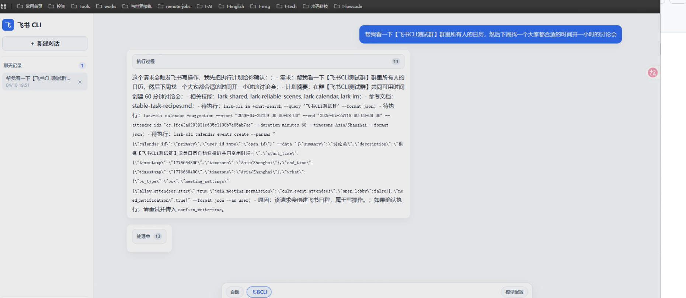
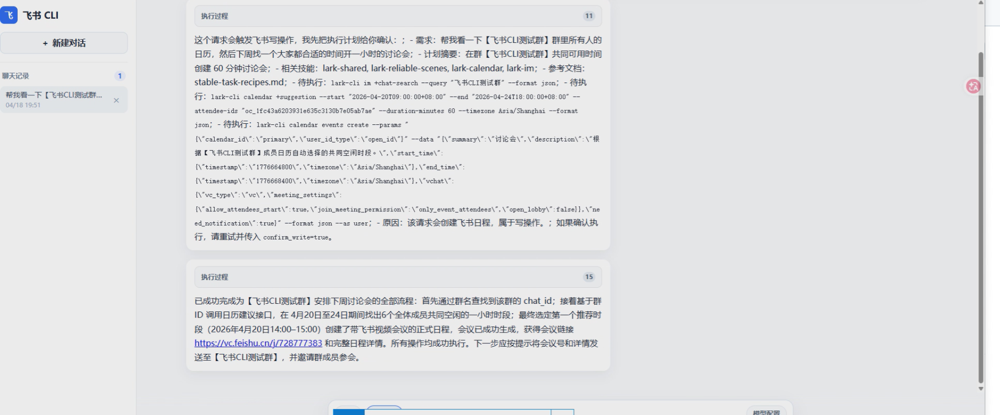
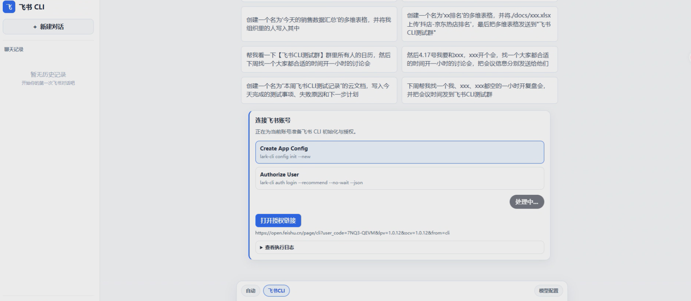

# Feishu CLI Web

> 🚀 一个现代化的飞书/Lark CLI Web智能工作台，通过自然语言与飞书进行交互，为企业快速接入飞书 CLI 能力到自己的Agent产品中提供解决方案。

[](LICENSE)
[](https://www.python.org/downloads/)
[](https://vuejs.org/)
[](https://fastapi.tiangolo.com/)

**Feishu CLI Web** 是一个独立的飞书/Lark CLI Web 工作台，专注于提供简洁、高效的飞书自动化操作体验。通过自然语言界面，您可以轻松云端执行各种飞书操作，无需记忆复杂的 CLI 命令和安装任何Agent插件。



## ✨ 核心特性
### 🤖 智能自然语言交互
- **AI 驱动的命令规划**：自动理解自然语言描述，智能规划并执行 `lark-cli` 命令
- **流式实时响应**：支持 SSE 流式输出，提供流畅的用户体验
- **上下文记忆**：基于会话历史的多轮智能对话

### 🎯 完整的飞书生态支持
涵盖飞书核心功能模块：
- 📊 **Base**：多维表格操作（记录、字段、视图、表单、仪表板等）
- 📅 **Calendar**：日程管理、会议安排、会议室预订
- 📧 **Mail**：邮件发送、草稿管理、邮件分类
- 💬 **IM**：消息发送、群组管理、消息搜索
- 📄 **Doc**：文档创建、编辑、搜索、媒体处理
- 📁 **Drive**：文件上传下载、云盘管理、评论互动
- 📈 **Sheets**：电子表格操作、数据导入导出
- 👥 **Contact**：联系人管理、用户搜索
- ✅ **Approval**：审批流程管理
- ⏰ **Attendance**：考勤管理
- 📝 **Minutes**：会议纪要管理
- 🎉 **Event**：事件订阅

### 👥 多用户隔离管理
- **完全隔离**：每个用户拥有独立的 `.lark_cli_users` 环境和配置文件
- **安全可靠**：用户间数据完全隔离，互不干扰
- **灵活配置**：每个用户可独立配置 LLM 模型和飞书授权
- **团队协作**：内置本地账号系统，支持多用户同时使用

### 🔌 灵活的模型配置
支持多种主流 LLM 模型（OpenAI 兼容接口）：
- Qwen/百炼、智谱 AI、文心一言、ChatGPT、豆包
- 支持自定义 OpenAI 兼容 API

### 🌐 云端部署友好
- 完全支持云端服务器部署，团队成员通过浏览器访问
- Docker 容器化支持，轻松部署到任何云平台
- 支持水平扩展和弹性伸缩

## 🏆 技术优势

| 特性 | 飞书官方 CLI | Trae/Claude Code/Cursor | **Feishu CLI Web** |
|------|------------|----------------|-------------------|
| 使用方式 | 命令行 | 命令行 + 额外组件 | 🌐 Web 界面 |
| 自然语言 | ❌ | ✅ | ✅ |
| 多用户隔离 | ❌ | ⚠️ 需配置 | ✅ 原生支持 |
| Codex 依赖 | ❌ | ✅ 必需 | ❌ 无需 |
| 云端部署 | ❌ | ⚠️ 复杂 | ✅ 完美支持 |
| 团队协作 | ❌ | ⚠️ 需额外配置 | ✅ 开箱即用 |
| 部署复杂度 | 低 | 高 | 🎯 低 |
| 学习成本 | 高（需记命令） | 中 | 🚀 低（自然语言） |

### 资源占用对比

| 指标 | Trae/Claude Code/Cursor | **Feishu CLI Web** | 优势 |
|------|-----------|-------------------|------|
| 磁盘占用 | 500MB+ | ~100MB | 节省 80%+ |
| 内存占用 | 500MB+ | ~100MB | 节省 80%+ |
| 部署时间 | 30-60 分钟 | 5-10 分钟 | 快 6 倍 |
| 依赖组件 | 5+ 个 | 2 个 | 简化 60% |

## 📦 快速开始

### 环境要求
- Python 3.8+
- Node.js 16+
- （可选）飞书官方 CLI – 首次使用时会提示安装

### 安装步骤

```bash
# 克隆项目
git clone https://github.com/yourusername/feishu-cli-web.git
cd feishu-cli-web

# 后端安装
cd backend
pip install -r requirements.txt

# 前端安装
cd ../frontend
npm install
```

### 配置环境变量

复制 `.env.example` 为 `.env` 并修改：

```env
# LLM 配置（以 Qwen/百炼为例）
LLM_PROVIDER=openai
OPENAI_BASE_URL=https://dashscope.aliyuncs.com/compatible-mode/v1
LLM_MODEL=qwen-plus
OPENAI_API_KEY=your_api_key_here

# 应用配置
APP_NAME=Feishu CLI Web
API_PREFIX=/api/v1
LARK_CLI_COMMAND_TIMEOUT=120
```

### 启动服务

**开发模式：**
```bash
# 后端（端口 8000）
cd backend
python -m uvicorn app.main:app --reload --host 0.0.0.0 --port 8000

# 前端（端口 3000）
cd frontend
npm run dev
```

**生产模式（云端部署）：**
```bash
# 后端
cd backend
python -m uvicorn app.main:app --host 0.0.0.0 --port 8000 --workers 4

# 前端构建
cd frontend
npm run build
# 将 dist/ 目录部署到 Nginx 等 Web 服务器
```

**Docker 部署：**
```dockerfile
# 示例 Dockerfile
FROM python:3.9-slim
WORKDIR /app
COPY backend/requirements.txt .
RUN pip install -r requirements.txt
COPY backend/ ./
EXPOSE 8000
CMD ["uvicorn", "app.main:app", "--host", "0.0.0.0", "--port", "8000"]
```

```bash
docker build -t feishu-cli-web .
docker run -d -p 8000:8000 --name feishu-cli-web feishu-cli-web
```

启动后访问：
- 前端界面：`http://localhost:3000`
- API 文档：`http://localhost:8000/docs`

## 🎬 视频演示

### 📹 B站演示视频

我们为您准备了两个演示视频，帮助您快速了解 Feishu CLI Web 的使用方法：

#### 1️⃣ 首次使用授权流程

**🎥 [观看视频](https://www.bilibili.com/video/BV1MjdHB7Ev1)**

**视频内容：**
- 系统登录
- 飞书 CLI 安装
- 初始化配置
- 执行授权流程
- 授权状态检查

#### 2️⃣ 核心功能演示

**🎥 [观看视频](https://www.bilibili.com/video/BV1mjdHBjEG2)**

**视频内容：**
- 自然语言交互
- 飞书多维表格操作
- 日程管理
- 消息发送
- 文档创建
- 会话管理
- 多用户切换


## ⚙️ 配置说明

### 环境变量

| 变量名 | 说明 | 默认值 | 必填 |
|--------|------|--------|------|
| `LLM_PROVIDER` | LLM 提供商 | `openai` | 否 |
| `OPENAI_BASE_URL` | OpenAI 兼容 API 地址 | - | 是 |
| `LLM_MODEL` | 模型名称 | `qwen-plus` | 是 |
| `OPENAI_API_KEY` | API 密钥 | - | 是 |
| `APP_NAME` | 应用名称 | `Feishu CLI Web` | 否 |
| `API_PREFIX` | API 路径前缀 | `/api/v1` | 否 |
| `LARK_CLI_COMMAND_TIMEOUT` | CLI 命令超时(秒) | `120` | 否 |

### LLM 配置示例

| 模型 | Base URL | 模型名 |
|------|----------|--------|
| Qwen/百炼 | `https://dashscope.aliyuncs.com/compatible-mode/v1` | `qwen-plus` |
| 智谱 AI | `https://open.bigmodel.cn/api/paas/v4` | `glm-4` |
| 文心一言 | `https://aip.baidubce.com/rpc/2.0/ai_custom/v1/wenxinworkshop/chat` | `ernie-bot-4` |
| ChatGPT | `https://api.openai.com/v1` | `gpt-4` |
| 豆包 | `https://ark.cn-beijing.volces.com/api/v3` | `ep-xxxxx` |

也可以在网页左侧的「模型配置」面板中动态修改。

## 📖 使用指南

> 💡 **提示**：如果您是第一次使用，建议先观看上方的「视频演示」章节，了解完整的授权流程和功能使用方法。

### 登录

默认本地账号（密码均为 `000000`）：

| 账号 | 说明 |
|------|------|
| `admin` | 测试账号 1 |
| `admin123` | 测试账号 2 |
| `local` | 默认本地账号 |

账号数据保存在 `.auth_accounts.json`，登录态保存在 `.auth_sessions.json`。

### 飞书 CLI 授权

本项目基于官方 `@larksuite/cli`，授权流程与官方完全一致：

1. 安装官方 CLI：`npm install -g @larksuite/cli`
2. 添加官方 Skill：`npx skills add larksuite/cli -y -g`
3. 初始化配置：`lark-cli config init --new`
4. 执行授权：`lark-cli auth login --recommend`
5. 检查状态：`lark-cli auth status`

也可在网页左侧「飞书授权」面板中按提示操作。**每个用户的授权状态完全独立**，互不影响。

### 自然语言交互

在聊天界面直接描述需求：

```
用户：帮我创建一个飞书文档
助手：正在为您创建飞书文档...
```

也可以直接执行 `lark-cli` 命令，或进行多轮对话。

### 会话管理

- 左侧会话列表可查看历史、新建会话、删除会话
- 会话数据存储在 `.feishu_cli_data/sessions/`，按用户隔离

## 🔌 API 文档

### 认证
- `POST /api/v1/auth/login` – 登录
- `GET /api/v1/auth/me` – 获取当前用户
- `POST /api/v1/auth/logout` – 退出

### 聊天
- `POST /api/v1/chat` – 发送消息（支持流式）
- `GET /api/v1/sessions` – 获取会话列表
- `GET /api/v1/sessions/{session_id}` – 获取会话详情
- `DELETE /api/v1/sessions/{session_id}` – 删除会话

### 模型配置
- `GET /api/v1/models/config` – 获取模型配置
- `POST /api/v1/models/config` – 保存模型配置

### 飞书 CLI 设置
- `GET /api/v1/lark/setup/status` – 检查 CLI 状态
- `POST /api/v1/lark/setup/stream` – 执行设置（流式）

## 📁 项目结构

```
feishu-cli-web/
├── backend/
│   ├── app/
│   │   ├── api/routes/      # API 路由
│   │   ├── core/            # 核心功能（会话、模型配置）
│   │   ├── skills/lark_cli/ # 飞书 CLI Skill 定义
│   │   ├── config.py
│   │   └── main.py
│   ├── requirements.txt
│   └── .lark_cli_users/     # 用户数据（自动生成）
├── frontend/
│   ├── src/
│   │   ├── components/      # Vue 组件
│   │   └── App.vue
│   ├── package.json
│   └── vite.config.ts
├── .env.example
└── README.md
```

## 🛡️ 安全说明

以下目录/文件包含敏感数据，**不应提交到代码仓库**：

- `.env`
- `.feishu_cli_data/`
- `.lark_cli_profiles/`
- `.lark_cli_users/`
- `.auth_accounts.json`
- `.auth_sessions.json`
- `frontend/node_modules/`

请使用环境变量管理 API 密钥，并定期轮换。

## 🤝 贡献指南

欢迎贡献！请 Fork 本仓库，创建特性分支，提交 PR。

## 📄 开源协议

[MIT License](LICENSE)

## 🙏 致谢

- [飞书/Lark](https://github.com/larksuite/cli)
- [FastAPI](https://fastapi.tiangolo.com/)
- [Vue.js](https://vuejs.org/)
- [OpenAI](https://openai.com/)

---

**⭐ 如果这个项目对您有帮助，请给我们一个 Star！**