# Feishu-CLI-Web 技术分享

> 主题：把飞书 CLI 产品化为可对话、可授权、可观测、可隔离的 Web 自动化工作台  
> 核心观点：这个项目不是“给 CLI 套网页”，而是围绕 **LLM 规划、CLI 执行、用户隔离、风险控制、执行可观测** 做了一套完整工程闭环。

## 1. 项目定位

| 维度 | 说明 |
| --- | --- |
| 项目目标 | 用户用自然语言描述飞书任务，系统自动规划并执行 `lark-cli` 命令 |
| 核心价值 | 把开发者 CLI 能力封装成普通用户可用的 Web 工作台 |
| 执行边界 | LLM 只负责规划，真实操作由官方 `lark-cli` 执行 |
| 安全边界 | 写操作必须二次确认，每个 Web 用户独立 CLI 授权环境 |
| 适用场景 | 飞书消息、联系人、日历、文档、云空间、表格、多维表格、邮件等自动化 |

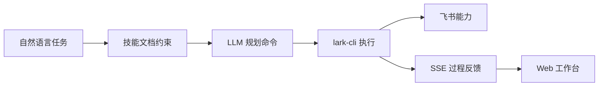

**一句话总结：Feishu-CLI-Web 把飞书 CLI 从命令行工具，升级成了一个有规划、有确认、有授权、有追踪的自动化入口。**

## 2. 设计思路

### 2.1 关键问题拆解

| 问题 | 如果不处理 | 当前设计 |
| --- | --- | --- |
| 用户不会写 CLI 命令 | 普通用户无法使用飞书自动化 | 用自然语言输入，由 LLM 规划 `lark-cli` |
| 飞书 OpenAPI 接口很多 | 后端需要维护大量 API、鉴权、参数、错误码 | 复用官方 `lark-cli` 作为执行层 |
| 模型容易幻觉 | 命令和参数不稳定 | 用 `SKILL.md` + reference 文档约束规划 |
| CLI 执行是黑盒 | 用户不知道系统卡在哪里 | 用 SSE 展示规划、执行、授权、修复过程 |
| 写操作有业务风险 | 模型理解错可能直接发消息或改数据 | 写操作先返回计划，用户确认后执行 |
| 多用户授权会串号 | A 用户可能用到 B 用户飞书身份 | 每个 Web 用户独立 HOME / USERPROFILE |

### 2.2 架构取舍

| 方案 | 优点 | 缺点 | 本项目选择 |
| --- | --- | --- | --- |
| 直接对接飞书 OpenAPI | 灵活、可深度定制 | 接口维护成本高，能力覆盖慢 | 不选 |
| 直接暴露 `lark-cli` 命令输入框 | 实现简单 | 用户门槛高，缺少风控和体验 | 不选 |
| LLM + skill 文档 + CLI 执行 | 覆盖快、可扩展、可控 | 依赖 skill 文档质量 | 选择 |

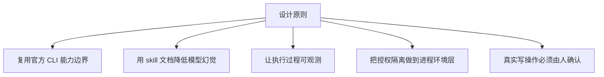

## 3. 整体架构

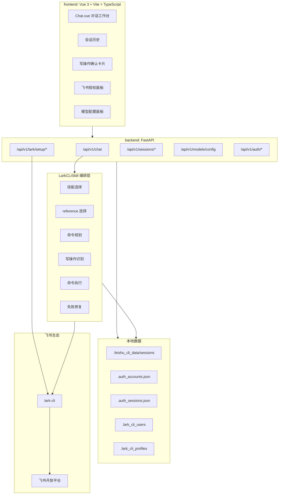

### 3.1 模块职责

| 模块 | 核心文件 | 职责 |
| --- | --- | --- |
| Web 工作台 | `frontend/src/components/Chat.vue` | 对话、SSE 解析、trace 展示、写操作确认、授权面板 |
| API 层 | `backend/app/api/routes/chat.py` | 会话上下文构建、流式响应、结果落盘 |
| 授权初始化 | `backend/app/api/routes/lark_setup.py` | CLI 安装检测、初始化、授权、补充 scope |
| 编排核心 | `backend/app/skills/lark_cli/skill_runtime.py` | skill 选择、命令规划、执行、修复、风控 |
| 用户隔离 | `backend/app/skills/lark_cli/profiles.py` | profile 生成、独立 HOME、CLI 环境变量 |
| 会话存储 | `backend/app/core/local_sessions.py` | 本地 JSON 会话读写、历史上下文 |

## 4. 核心执行链路

### 4.1 正常链路

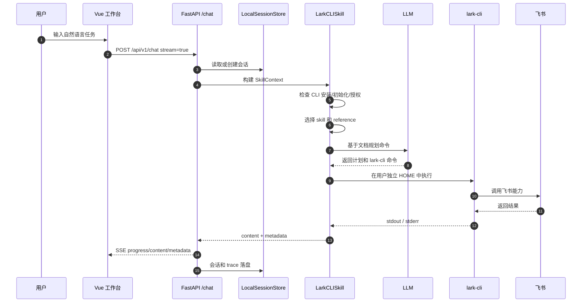

### 4.2 写操作链路

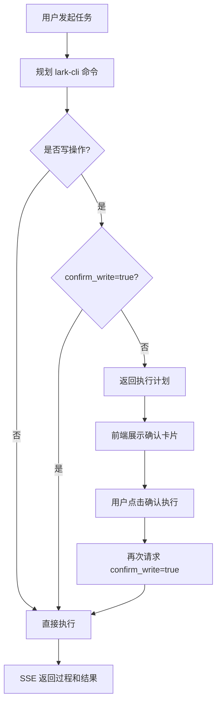

### 4.3 失败恢复链路

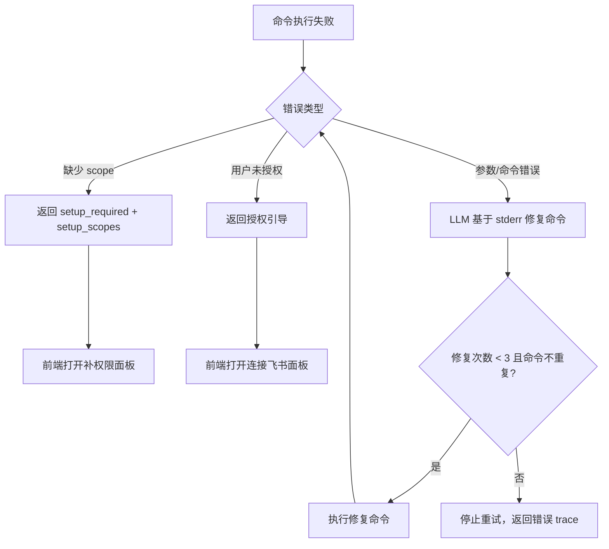

## 5. 技能文档增强设计

### 5.1 设计目标

| 目标 | 实现方式 |
| --- | --- |
| 降低模型幻觉 | 不让模型凭空猜 API，而是读取项目内 skill 和 reference |
| 控制命令格式 | skill 文档沉淀 CLI 用法、参数规则、典型场景 |
| 提升可扩展性 | 新增能力优先补文档，不优先改主流程 |
| 方便问题定位 | metadata 记录 selected_skills、references、executed_commands |

### 5.2 skill 体系

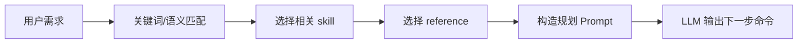

| 能力域 | skill | 典型任务 |
| --- | --- | --- |
| 消息 | `lark-im` | 发消息、回复、查群聊、查消息 |
| 通讯录 | `lark-contact` | 搜索用户、获取用户 ID |
| 日历 | `lark-calendar` | 查日程、安排会议、查空闲时间 |
| 云文档 | `lark-doc` | 创建、读取、更新文档 |
| 云空间 | `lark-drive` | 上传、下载、导出、移动文件 |
| 多维表格 | `lark-base` | 表、字段、记录、视图、仪表盘 |
| 电子表格 | `lark-sheets` | 表格读写 |
| 邮件 | `lark-mail` | 发邮件、草稿、回复、转发 |

### 5.3 编排模型

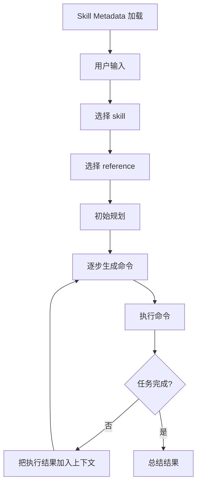

| 控制点 | 当前实现 |
| --- | --- |
| 最大执行步数 | `MAX_LARK_CLI_STEPS = 10` |
| 单次命令超时 | 默认 30 秒，可由配置覆盖 |
| LLM 规划超时 | 默认 25 秒 |
| 自动修复次数 | 最多 3 次 |
| 重复命令保护 | 已执行命令进入 `seen_commands`，重复则停止 |

## 6. 用户隔离设计

### 6.1 为什么要隔离到 CLI HOME

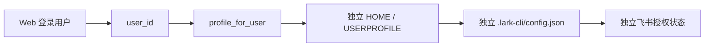

| 风险 | 传统做法的问题 | 当前做法 |
| --- | --- | --- |
| 授权串号 | 只在数据库区分用户，但 CLI 仍共用本地配置 | 每个用户独立 HOME |
| profile 冲突 | 用户名可能含特殊字符或重复 | 账号规范化 + SHA1 短摘要 |
| CLI 不理解 Web 用户 | 官方 CLI 只认本地环境 | 通过进程环境变量模拟独立用户环境 |

### 6.2 隔离目录

```text
backend/
├── .lark_cli_users/
│   └── feishu-cli-web-admin-d033e22a/
│       └── .lark-cli/
│           └── config.json
└── .lark_cli_profiles/
    └── feishu-cli-web-admin-d033e22a.json
```

| 数据 | 存储位置 | 作用 |
| --- | --- | --- |
| CLI HOME | `.lark_cli_users/{profile}` | 当前 Web 用户专属 CLI 环境 |
| CLI 配置 | `.lark_cli_users/{profile}/.lark-cli/config.json` | 当前用户飞书 app / user 授权 |
| profile 状态 | `.lark_cli_profiles/{profile}.json` | 初始化、授权等状态记录 |

**设计亮点：真正的隔离边界不是 Web 账号字段，而是 `lark-cli` 进程看到的 HOME / USERPROFILE。**

## 7. 流式可观测设计

### 7.1 SSE 事件模型

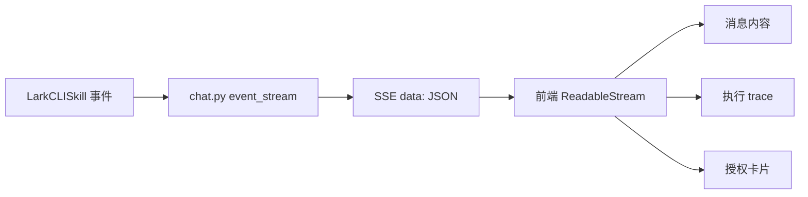

| SSE 类型 | 内容 | 前端表现 |
| --- | --- | --- |
| `session` | 当前会话 ID | URL 和会话状态同步 |
| `progress` | 技能选择、参考文档、规划、执行、修复 | 折叠 trace |
| `content` | 最终文本回复 | 消息正文 |
| `metadata` | plan、commands、stdout、stderr、setup 信息 | trace、授权面板、历史元数据 |
| `done` | 完成信号 | 停止 loading |
| `error` | 异常信息 | 错误提示 |

### 7.2 可观测收益

| 对象 | 收益 |
| --- | --- |
| 用户 | 知道系统正在规划、执行、授权还是修复 |
| 演示者 | 可以展示系统完整执行过程，不是只展示最终答案 |
| 开发者 | 根据 trace 定位模型规划、CLI 参数、权限 scope、授权状态问题 |

## 8. 安全控制设计

### 8.1 写操作识别

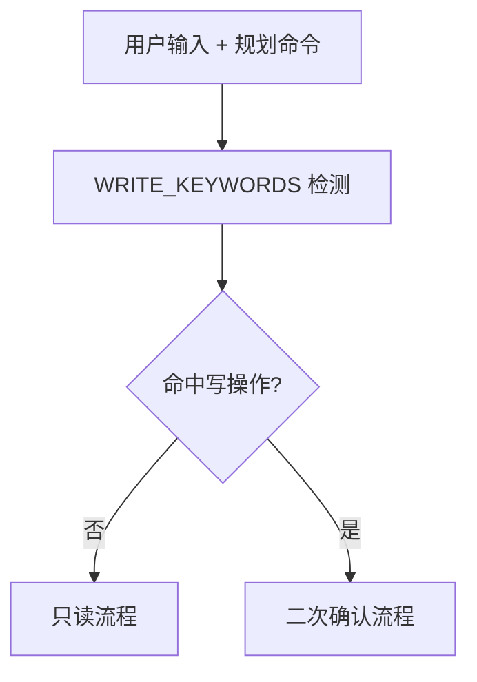

| 写操作类型 | 示例 |
| --- | --- |
| 消息类 | send、reply、发送、回复 |
| 数据变更 | create、update、delete、remove、写入、删除 |
| 文件类 | upload、download、import、export、移动 |
| 协作类 | schedule、invite、add、edit |

### 8.2 风控矩阵

| 风险点 | 控制措施 |
| --- | --- |
| 模型误发消息 | 写操作先返回计划，用户确认后执行 |
| 执行任意 shell 命令 | `execute_command` 仅允许 `lark-cli` 开头 |
| shell 控制符注入 | 检测未引用的控制操作符 |
| 无限规划循环 | 最大 10 步 |
| 无限修复重试 | 最多自动修复 3 次 |
| 重复命令循环 | `seen_commands` 去重 |
| 缺权限失败 | 自动识别 scope 并触发补授权 |

## 9. 授权补全设计

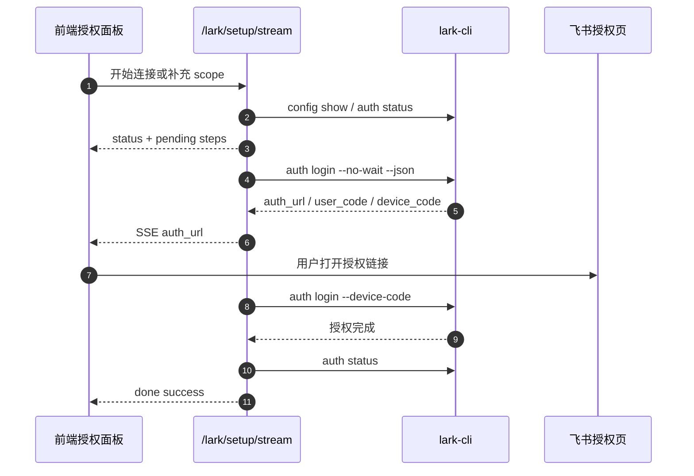

| 场景 | 后端返回 | 前端动作 |
| --- | --- | --- |
| CLI 未初始化 | setup steps | 展示初始化步骤 |
| 用户未授权 | `setup_required=true` | 打开连接飞书面板 |
| 缺少 scope | `setup_scopes=[...]` | 打开补权限面板 |
| 授权中 | auth URL / user code | 展示授权链接和授权码 |
| 授权失败 | terminal log | 展开执行日志 |

## 10. API 与数据设计

### 10.1 API 分层

| API | 职责 |
| --- | --- |
| `POST /api/v1/chat` | 自然语言请求、直接命令、SSE 流式执行 |
| `GET /api/v1/sessions` | 当前用户会话列表 |
| `GET /api/v1/sessions/{id}/messages` | 会话消息读取 |
| `DELETE /api/v1/sessions/{id}` | 删除会话 |
| `GET /api/v1/lark/setup/status` | 检查当前用户 CLI 状态 |
| `POST /api/v1/lark/setup/stream` | 流式初始化、授权、补 scope |
| `GET /api/v1/models/config` | 读取模型配置和预设 |
| `POST /api/v1/models/config` | 保存模型配置 |
| `POST /api/v1/auth/login` | 本地账号登录 |
| `GET /api/v1/auth/me` | 当前账号 |
| `POST /api/v1/auth/logout` | 退出登录 |

### 10.2 本地数据

| 数据 | 路径 | 说明 |
| --- | --- | --- |
| 会话 | `.feishu_cli_data/sessions/{user_id}/{session_id}.json` | 消息、metadata、trace |
| 账号 | `.auth_accounts.json` | 本地账号 |
| 登录态 | `.auth_sessions.json` | 本地 session token |
| CLI 用户环境 | `backend/.lark_cli_users/{profile}` | 用户级 CLI HOME |
| CLI profile 状态 | `backend/.lark_cli_profiles/{profile}.json` | 初始化和授权状态 |

### 10.3 会话数据结构

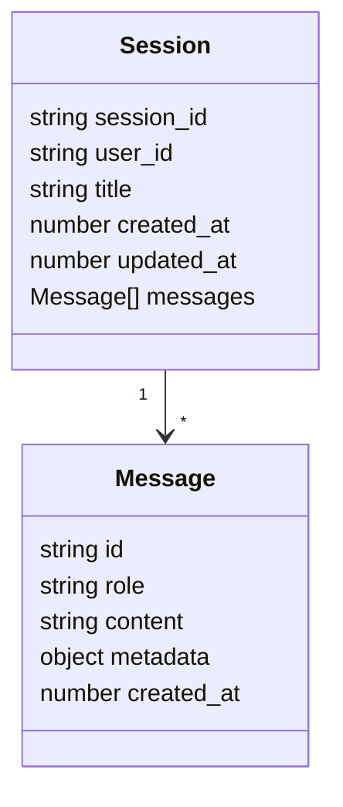

## 11. 项目亮点汇总

| 亮点 | 体现 |
| --- | --- |
| 不是简单套壳 | 有 LLM 编排、skill 约束、执行 trace、风控、授权闭环 |
| 能力覆盖快 | 复用官方 `lark-cli`，避免重写大量 OpenAPI |
| 模型更可控 | skill markdown 和 reference 限定规划空间 |
| 多用户更安全 | 每个用户独立 HOME / USERPROFILE，避免授权串号 |
| 执行可观测 | SSE 返回 progress、metadata、trace |
| 写操作可控 | 先计划，后确认，再执行 |
| 失败可恢复 | 缺权限走补授权，参数错误走自动修复 |
| 易扩展 | 新能力优先增加 skill 和 reference |

## 12. 演示路径

| 顺序 | 场景 | 输入示例 | 展示重点 |
| --- | --- | --- | --- |
| 1 | 只读查询 | `帮我看一下今天有哪些日程` | skill 选择、SSE 过程、最终结果 |
| 2 | 写操作确认 | `帮我给某某发个飞书消息：明天下午三点开会` | 首次只返回计划，确认后执行 |
| 3 | 授权补全 | 使用未授权账号或触发缺 scope 能力 | 授权卡片、auth URL、terminal log |
| 4 | trace 排查 | 展开某次执行过程 | 命令、stdout、stderr、修复记录 |

## 13. 后续演进

| 方向 | 当前状态 | 演进方案 |
| --- | --- | --- |
| 认证体系 | 本地账号 JSON | 接入企业统一认证 |
| 数据存储 | 本地 JSON | 数据库化会话、审计、执行记录 |
| 命令安全 | `lark-cli` 前缀限制 + 控制符检测 | 命令白名单、参数 schema 校验 |
| 长任务 | SSE 单请求执行 | 任务队列 + 状态表 |
| skill 质量 | 文档驱动 | 建立测试集、版本管理、回归评估 |
| 审计能力 | 会话 metadata | 独立审计日志、敏感操作审批 |

## 14. 最终总结

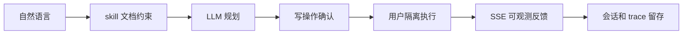

**Feishu-CLI-Web 的核心设计，是把 LLM 放在“规划层”，把 `lark-cli` 放在“执行层”，把 Web 放在“交互和风控层”。**

这样既能利用模型理解自然语言的能力，又不会让模型直接越过权限、确认和执行边界。项目真正的亮点不在于技术栈本身，而在于把 CLI 自动化产品化时补齐了五个工程能力：

| 能力 | 关键词 |
| --- | --- |
| 规划能力 | skill markdown、reference、LLM planning |
| 执行能力 | official `lark-cli` |
| 隔离能力 | per-user HOME / USERPROFILE |
| 风控能力 | write confirmation、command guard |
| 可观测能力 | SSE、trace、metadata |
